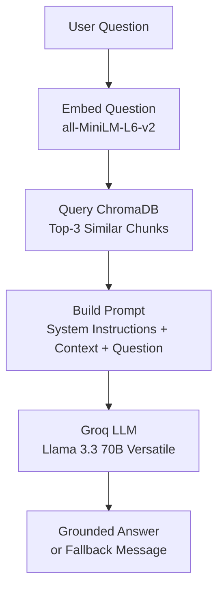

<div align="center">


<br/>


</div>

---

## 📖 Overview

A Retrieval-Augmented Generation (RAG) chatbot that answers questions strictly from a custom FAQ knowledge base. It embeds and stores FAQ content in ChromaDB, retrieves the most relevant chunks for any incoming question, and generates a grounded answer using an LLM — falling back to a "contact support" message instead of hallucinating when a question is out of scope.

## ✨ Features

- 📥 **Ingestion pipeline** — chunks FAQ data, generates embeddings, and stores them in a persistent ChromaDB vector store
- 🔍 **Query pipeline** — embeds the user's question, retrieves the top-3 most relevant chunks via similarity search, and builds a context-grounded prompt
- 🧠 **LLM-generated answers** via Groq's Llama 3.3 70B for fast inference
- 💬 Handles greetings and small talk (Hi, Hello, Thank you) naturally
- 🚫 Falls back to *"I don't have that information, please contact support"* for out-of-scope questions
- 🖥️ Lightweight front-end chat interface

## 🏗️ Architecture



## 🛠️ Tech Stack

| Layer             | Technology                                  |
|--------------------|----------------------------------------------|
| Backend            | FastAPI                                      |
| Vector Database    | ChromaDB (persistent client)                 |
| Embedding Model    | `all-MiniLM-L6-v2` (Sentence Transformers)   |
| LLM                | Llama 3.3 70B Versatile (via Groq API)       |
| Language           | Python                                       |

## 📁 Project Structure

```
.
├── main.py              # FastAPI app: chat endpoint + query pipeline
├── ingest.py             # Ingestion script: builds the ChromaDB vector store
├── index.html            # Front-end chat interface
├── data/                  # Source FAQ data
├── schemas/                # Pydantic request/response models
├── chroma_db/               # Persistent vector store (generated, not committed)
├── requirements.txt
├── .env.example
├── .gitignore
└── README.md
```

## ⚙️ Setup

### 1. Clone the repo
```bash
git clone https://github.com/kartik99kumar1/RAG_Support_Chat_Assistant_P01.git
cd RAG_Support_Chat_Assistant_P01
```

### 2. Create a virtual environment
```bash
python -m venv venv

# Windows
venv\Scripts\activate

# macOS/Linux
source venv/bin/activate
```

### 3. Install dependencies
```bash
pip install -r requirements.txt
```

### 4. Set up environment variables
Copy `.env.example` to `.env` and add your Groq API key:
```
GROQ_API_KEY=your_groq_api_key_here
```

### 5. Run ingestion (builds the vector store from your FAQ data)
```bash
python ingest.py
```

### 6. Start the server
```bash
uvicorn main:app --reload --port 5500
```

### 7. Open the chat interface
Navigate to `http://127.0.0.1:5500/index.html`

## 🔌 API Reference

**POST** `/chat`

**Request**
```json
{
  "question": "What is your return policy?"
}
```

**Response**
```json
{
  "answer": "You can return any item within 30 days of purchase for a full refund, as long as it is unused and in original packaging."
}
```

## 🎥 Demo

> Add a GIF or screen recording of the chat interface here, e.g.:
> ``

## 🚀 Future Improvements

- [ ] Multi-turn conversation memory
- [ ] Docker deployment
- [ ] Streaming responses
- [ ] Intent classification for smarter fallback routing
- [ ] Admin panel to update FAQ data without re-running ingestion

## 📄 License

This project is licensed under the MIT License.

---

<div align="center">
Made with ⚡ by <a href="https://github.com/kartik99kumar1">Kartik Kumar</a>
</div>


Frontend: https://kartik99kumar1.github.io/RAG_Support_Chat_Assistant_P01/
Backend: https://rag-support-chat-assistant-p01.onrender.com
